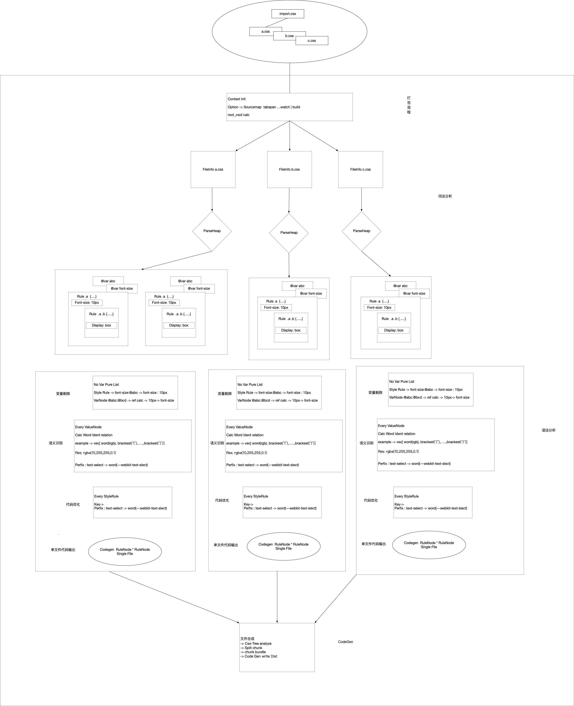

# Rust-Style 架构解析

## 流程




## Context

* 全局上下文 创建一次 bundle/transform 必须初始化声明的对象
* 使用示例
```rust
#[test]
fn test_less_render() {
  let filepath = path_resolve("assets/test.less");
  // 会根据 传入的 目录 判定当前上下文的工作目录 用来解决内部 resolve 的问题，这里并不是要去 进行 parse | render 的文件
  let context = Context::new(Default::default(), Some(filepath.clone())).unwrap();
  let res = context.render(filepath.clone()).unwrap();
  println!("{}", res);
}
```

* 数据结构
```rust
///
/// 全局调用 转化时的 上下文
///
pub struct Context {
  // 内部调用方式时 需要拿到对应的 转化配置
  pub option: ParseOption,
  // 转文件 的缓存
  pub filecache: ParseCacheMap,
  // 文件的绝对路径 入口文件
  pub application_fold: String,
  // 已经生成目录的 文件
  pub code_gen_file_path: Vec<String>,
}
```

* 所有权转义 调用 render | parse 都会将 应用上下文 从 栈 -> 堆上 并且共享给所有的 Rc<FileInfo>
```rust
///
/// 产生代码
///
pub fn render(self, filepath: String) -> Result<String, String> {
let context = Rc::new(RefCell::new(self));
FileInfo::create_disklocation(filepath, context)
}

///
/// 解析代码
///
pub fn parse(self, filepath: String) -> Result<FileRef, String> {
let context = Rc::new(RefCell::new(self));
FileInfo::create_disklocation_parse(filepath, context)
}
```

## FileInfo

* 文件信息，
  * 在 transfrom 过程中，会得到一个 以当前 "fileinfo" 为对象的 树形结构 -> 小文件bundle
  * 在 bundle 过程中，会拿取提供的所有 Vec<FileInfo> 在多个 树之间进行比较 -> 后续会提取 公共 css FileInfo 标识出来

* 数据结构

```rust
#[derive(Clone)]
pub struct FileInfo {
  // 文件的磁盘位置
  pub disk_location: String,
  // 文件的原始内容
  pub origin_txt_content: String,
  // 根据 原始内容 -> 转化的 字符数组
  pub origin_charlist: Vec<char>,
  // 文件的 原始AST节点
  pub block_node: Vec<StyleNode>,
  // 当前所有 索引 对应的 坐标行列 -> 用于执行 sourcemap
  pub locmap: Option<LocMap>,
  // 全局上下文
  pub context: ParseContext,
  // 自身弱引用
  pub self_weak: FileWeakRef,
  // 该文件的引用文件 注意(其他被引用的 css | less | sass 也放在堆上 被指针 所引用)
  pub import_files: Vec<FileRef>,
}
```

* 结构示例

```css
@import "index.less";
@width: 400px;
@height: 300px;
@font_size: 12px;
@abc: 1px + (20px*30px) solid #fff;

// adbcdefg
/*
 * askldjasdjaklsdjalksdjalksdjlasd
 */

textarea {
  width: @width;
  height: @height;
  font-size: @font_size;
  border: @abc;
  @font_size: 12px;

  .a {
    font-size: @font_size;

    .c {
      font-size: @font_size;
    }
  }

  .b {
    font-size: @font_size;
  }
}


@media screen and ( min-width: 900px) {
  .xyz {
    font-size: @font_size;
    @media screen and ( max-width: 900px) {
      color: red;
    }
  }
}

```

``` json
{
  "disk_location": "/Users/zhushijie/Desktop/github/rust-less/assets/demo.less",
  "block_node": [
    {
      "Comment": {
        "content": "// adbcdefg\n",
        "loc": {
          "line": 7,
          "col": 1,
          "char": "/",
          "index": 108
        }
      }
    },
    {
      "Var": {
        "Import": {
          "content": "@import \"index.less\";",
          "loc": {
            "line": 1,
            "col": 1,
            "char": "@",
            "index": 0
          },
          "path": "index.less"
        }
      }
    },
    {
      "Rule": {
        "content": "width: @width;\n  height: @height;\n  font-size: @font_size;\n  border: @abc;\n  @font_size: 12px;\n\n  .a {\n    font-size: @font_size;\n\n    .c {\n      font-size: @font_size;\n    }\n  }\n\n  .b {\n    font-size: @font_size;\n  }",
        "loc": {
          "line": 12,
          "col": 1,
          "char": "t",
          "index": 164
        },
        "select": "textarea",
        "block_node": [
          {
            "Var": {
              "StyleRule": {
                "content": "width: @width;",
                "loc": {
                  "line": 12,
                  "col": 8,
                  "char": "w",
                  "index": 0
                },
                "uuid": "b2d50d96-f024-4371-bcb3-6a1e2451dfb7",
                "key": "width",
                "value": {
                  "content": "@width",
                  "ident": [
                    {
                      "Var": "@width"
                    }
                  ]
                }
              }
            }
          }
        ]
      }
    }
  ],
  "import_file": [
    {
      "disk_location": "/Users/zhushijie/Desktop/github/rust-less/assets/index.less",
      "block_node": [
      ],
      "import_file": []
    }
  ]
}

```

## StyleNode

* 通用的 节点 认为所有 css | less | scss 组成的部分 都为 StyleNode 组成

* rust 引用地方 -> 样式预处理 非普通 css 需要支持 节点的 嵌套调用 

```rust
#[derive(Clone)]
pub struct FileInfo {
  // 文件的磁盘位置
  pub block_node: Vec<StyleNode>,
}

#[derive(Clone)]
pub struct RuleNode {
  // 选择器 文字
  pub selector: Option<SelectorNode>,
  // 节点 子节点
  pub block_node: Vec<StyleNode>,
}

```

## CommentNode

* StyleNode-> enum(CommentNode) 属于 通用节点 的子类 AST结构中 标识了 注释 片段 的所有信息

* css 示例

```
// adbcdefg
/*
 * askldjasdjaklsdjalksdjalksdjlasd
 */
```

* 数据结构

```rust
#[derive(Clone, Serialize)]
pub struct CommentNode {
  // 节点内容
  pub content: String,
  // 节点坐标
  pub loc: Option<Loc>,
  // 注释开始索引
  #[serde(skip_serializing)]
  pub startindex: usize,
}
```

* 结构示例

```json
{
  "Comment": {
    "content": "// adbcdefg\n",
    "loc": {
      "line": 7,
      "col": 1,
      "char": "/",
      "index": 108
    }
  }
}
```


## VarRuleNode

* StyleNode-> enum(VarRuleNode) 属于 通用节点 的子类 AST结构中 标识了 @import | @var | display 等以 分号为结算的 '行'节点信息

* 数据结构

```rust
///
/// 变量内容
///
#[derive(Debug, Clone, Serialize)]
pub enum VarRuleNode {
  /// 引用
  Import(ImportNode),

  /// 变量声明
  Var(VarNode),

  /// 样式规则
  StyleRule(StyleRuleNode),
}
```

```css
// Import(ImportNode) -> VarRuleNode 认为是一个 VarRuleNode 变量节点 ImportNode
@import "index.less";
// Var(VarNode) -> VarRuleNode 认为是一个 VarRuleNode 变量节点 VarNode
@width: 400px;

.a{
  // StyleRule(StyleRuleNode) -> StyleRuleNode 认为是一个 VarRuleNode 变量节点 StyleRuleNode
  width: 20px;
}
```

### ImportNode

* css 示例
```css
@import "index.less";
```

* 数据结构
```rust
#[derive(Clone)]
pub struct ImportNode {
  // 节点坐标
  pub loc: Option<Loc>,

  // 内部处理 地图
  map: LocMap,

  // 自身 Rule 的弱引用
  parent: NodeWeakRef,

  // 文件信息
  pub fileinfo: FileWeakRef,

  // 内部快速扫词 字符串 数组
  charlist: Vec<char>,

  // 经常 插件 hook 的 计算完的 文件地址
  parse_hook_url: String,

  // 上下文
  pub context: ParseContext,
}
```

* parse 方法注意

```rust
// 多文件翻译后 会在 Context 上下文 中建立 文件 地址的 缓存
// 引用的 FileInfo 不会放在 ImportNode 节点 而是放在 ImportNode 所属的 FileInfo 中 ImportFIles 中
if let Some(weak_file_ref) = weak_file_ref_option {
  let heap_obj = weak_file_ref.upgrade().unwrap();
  importfiles.push(heap_obj);
} else {
  let heap_obj = FileInfo::create_disklocation_parse(abs_path.clone(), self.context.clone())?;
  importfiles.push(heap_obj.clone());
  self
    .context
    .borrow_mut()
    .set_cache(abs_path.as_str(), Some(Rc::downgrade(&heap_obj)));
}
```


### VarNode

* css 示例
```css
@width: 400px;
```

```rust
#[derive(Clone)]
pub struct VarNode {
  // 节点坐标
  pub loc: Option<Loc>,

  // uuid 避免 查找时循环引用
  pub uuid: String,

  // 内部处理 地图
  map: LocMap,

  // 字符串 操作 序列
  charlist: Vec<char>,

  // 节点 父节点
  pub parent: NodeWeakRef,

  // 文件信息
  pub fileinfo: FileWeakRef,

  pub key: Option<String>,

  pub value: Option<ValueNode>,

  // 上下文
  pub context: ParseContext,
}
```

### StyleRuleNode

* css 示例
```css
color: red;
```

```rust
#[derive(Clone)]
pub struct StyleRuleNode {
  // 节点坐标
  pub loc: Option<Loc>,

  // 字符串 操作 序列
  charlist: Vec<char>,

  // uuid 避免 查找时循环引用
  pub uuid: String,

  // 内部处理 地图
  map: LocMap,

  // 文件信息
  pub fileinfo: FileWeakRef,

  // 节点 父节点
  pub parent: NodeWeakRef,

  // 上下文
  pub context: ParseContext,

  // 对应的 key 值
  pub key: Option<String>,

  // 对应 值
  pub value: Option<ValueNode>,
}
```


## ValueNode

* ValueNode 是 整个 Parse 流程中 最关键的 节点，不管是 @ 变量声明 还是 样式规则 都可以理解为 key:value 的 声明形式，针对共同的 value 是有同一个解析的 到 codegen 的过程

* 数据结构

```rust
#[derive(Clone)]
pub struct ValueNode {
  // 字符 向量 只读
  pub charlist: Vec<char>,

  // rule 父节点
  pub parent: NodeWeakRef,

  // 文件节点
  pub fileinfo: FileWeakRef,

  // 内部处理 地图
  map: LocMap,

  // 单词 范式 原始分词 定义词性 的数组
  pub word_ident_list: Vec<IdentType>,
}


///
/// 原始 词性 分割
/// 
#[derive(Clone, Serialize, Debug, PartialEq)]
pub enum IdentType {
  // 10px 100% 100vh
  Number(String, Option<String>),
  // + - * /
  Operator(String),
  // @abc
  Var(String),
  // $abc
  Prop(String),
  // @{abc}
  InsertVar(String),
  // "abc"
  StringConst(String),
  // solid
  Word(String),
  // #abc17fc
  Color(String),
  // !important
  KeyWord(String),
  // " " ,"\n"
  Space,
  //  ~"(min-width: 768px)" (min-width: 768px) -> Only for MediaRule
  Escaping(String),
  // ( ) [ ] 计算运算可能性
  Brackets(String),
}
```

* codegen

```rust
///
/// 代码生成
///
pub fn code_gen(&self) -> Result<String, String> {
  // 去除 所有 value_node节点中 变量的声明
  let mut no_var_list = self.get_no_var_ident_list()?;
  // 对 所有词性 进行 递归计算 进行 分词合并 成 句 的过程
  let res = Self::group_calc_ident_value(no_var_list)?;
  Ok(res)
}
```

## NodeRef

* StyleNode-> 属于 通用节点(SytleNode) 的子类 AST结构中 标识了 .a{} 以大括号 为标识的 段落信息，并且为了支持样式预处理器，
把AST 信息放在了堆上，用来重复引用，设置其 子RuleNode 父子RuleNode 的引用关系。

* css 示例
```less

.b {
  font-size: 10px;
}

// 允许对象 递归嵌套
.b {
  .a{
    font-size: 10px;
  }
}

```

* 数据结构

```rust
#[derive(Clone)]
pub struct RuleNode {
  // 选择器 文字
  pub selector: Option<SelectorNode>,
  // 根据 原始内容 -> 转化的 字符数组
  pub origin_charlist: Vec<char>,
  // 节点坐标
  pub loc: Option<Loc>,
  // 当前所有 索引 对应的 坐标行列 -> 用于执行 sourcemap
  pub locmap: Option<LocMap>,
  // 节点 父节点
  pub parent: NodeWeakRef,
  // 自己的引用关系
  pub weak_self: NodeWeakRef,
  // 节点 子节点
  pub block_node: Vec<StyleNode>,
  // 文件弱引用
  pub file_info: FileWeakRef,
  // 全局上下文
  pub context: ParseContext,
}


#[derive(Debug, Clone, Serialize)]
pub enum SelectorNode {
  Select(NewSelector),
  Media(MediaQuery),
}
```


